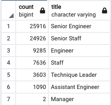

# Pewlett-Hackard-Analysis
## 1. Overview of the Analysis

### 1.1. Purpose
  The purpose of the Pewlett-Hackard-Analysis is determine the number of retiring employees per title, and identify employees who are eligible to participate in a mentorship program. This programn has been called: "Silver Tsunami".
  
  
## 2. Pewlett-Hackard Results

* Total Employees:** 300,024 

* Number of employees by their most recent job title who are about to retire:** 72458, From the 100% of eligible for retirement were 
  * Senior Engineer: 35.77%  
  * Senior Staff: 34.40% 
  * Engineers: 12.81%
  * Staff :10.54% 
  * Technique Leader: 4.97% 
  * Assitant Engineer: 1.5% 

Table below shows the number for each of these titles:

  

**Number of Employees Eligible for the Mentorship Program:** 1549

## 3.Pewlett-Hackard Summary

* The number of roles will need to be filled as the "silver tsunami" begins to make an impact is: 72,458.

* There are enough qualified, retirement ready employees to mentor, At an average we can around 18,000 employees for each birth year excluding 1965. 
